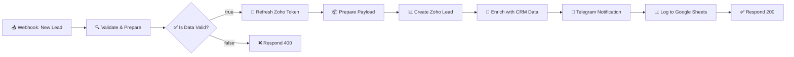

# Architecture

A node-by-node breakdown of the lead capture pipeline, the data each step produces, and the design decisions behind the structure.

---

## High-level flow



The flow has two branches. If validation fails, it short-circuits to a 400 response. Otherwise it walks a linear chain through five external API calls before responding 200.

---

## Node-by-node

### 1. 📥 Webhook: New Lead

- **Type:** `n8n-nodes-base.webhook`
- **Method:** `POST`
- **Path:** `/lead-capture`
- **Response mode:** `responseNode` — means the webhook doesn't auto-respond. The final response is emitted by a `Respond to Webhook` node, which lets us return a 200 or 400 based on what happened downstream.

**Accepts JSON like:**

```json
{
  "name": "John Doe",
  "email": "john@test.com",
  "phone": "+1234567890",
  "message": "I need your services",
  "source": "Landing Page"
}
```

All fields except `name` and `email` are optional.

---

### 2. 🔍 Validate & Prepare

- **Type:** `n8n-nodes-base.code` (JavaScript)

Handles three concerns in one node:

1. **Normalization** — trims whitespace, lowercases the email, coerces to strings
2. **Validation** — required fields check, regex-based email format check
3. **Shape transformation** — splits `name` into `firstName` / `lastName` for Zoho's schema, adds an ISO timestamp

**Output on success:**

```json
{
  "valid": true,
  "firstName": "John",
  "lastName": "Doe",
  "fullName": "John Doe",
  "email": "john@test.com",
  "phone": "+1234567890",
  "message": "I need your services",
  "source": "Landing Page",
  "timestamp": "2026-01-15T10:30:00.000Z"
}
```

**Output on failure:**

```json
{
  "valid": false,
  "errors": ["Field email is required", "Invalid email format"]
}
```

**Design note:** single name field → split into two. Many contact forms only ask for "Full Name" but Zoho requires `Last_Name`. If only one word is given, the workflow uses `-` as last name to satisfy the API without making up data.

---

### 3. ✅ Is Data Valid?

- **Type:** `n8n-nodes-base.if`

Branches on `$json.valid`. True goes to Zoho; false goes to the 400 response node.

**Design note:** validation is separated from the response to keep business logic out of response nodes. This makes it easy to add more validators later (phone format, disposable-email blocklist, etc.) without touching response code.

---

### 4. 🔑 Refresh Zoho Token

- **Type:** `n8n-nodes-base.httpRequest`
- **Method:** `POST`
- **URL:** `https://accounts.zoho.{region}/oauth/v2/token`
- **Body:** `grant_type=refresh_token&client_id=...&client_secret=...&refresh_token=...`

Zoho access tokens expire after **1 hour**. Rather than manage token storage, we trade a small latency cost (~200ms) for a fresh token on every run. This means:

- No cache invalidation logic
- No cold-start failures after idle periods
- Refresh token is long-lived (never expires unless revoked)

**Output:**

```json
{
  "access_token": "1000.xxx...",
  "expires_in": 3600,
  "api_domain": "https://www.zohoapis.com",
  "token_type": "Bearer"
}
```

---

### 5. 📦 Prepare Payload

- **Type:** `n8n-nodes-base.code` (JavaScript)

The "fan-out" preparation node. Takes the validated lead + the access token and builds three stringified JSON payloads — one for each downstream service — in a single place. Centralizing payload construction here keeps the HTTP nodes dumb: they just pass strings through.

**Key responsibilities:**

- Fail loudly if the access token is missing (throws with a pointer to the likely fix)
- Build Zoho's `{ data: [{...}] }` envelope with all required CRM fields
- Compose the Telegram HTML message with emoji, formatting, and timezone-aware timestamp
- Build the Google Sheets query payload

**Why pre-build, not inline per node?**
Each HTTP node otherwise needs its own expression logic. Centralizing makes the downstream HTTP nodes trivial to swap out (e.g., replace Telegram with Slack → change one function, not three nodes).

---

### 6. 📊 Create Zoho Lead

- **Type:** `n8n-nodes-base.httpRequest`
- **Method:** `POST`
- **URL:** `https://www.zohoapis.{region}/crm/v2/Leads`
- **Auth:** `Authorization: Zoho-oauthtoken {{$json.accessToken}}`
- **Body:** raw JSON from `$json.zohoBody`

**Config quirk:** `neverError: true` is set. This means the node won't abort the workflow on a 4xx/5xx response — it passes the error through as data. The next node decides how to handle it, so a failed Zoho call doesn't block Telegram/Sheets from running.

**Success response:**

```json
{
  "data": [{
    "code": "SUCCESS",
    "details": { "id": "6543210000001234567", "..." : "..." },
    "status": "success"
  }]
}
```

---

### 7. 🔗 Enrich with CRM Data

- **Type:** `n8n-nodes-base.code` (JavaScript)

Extracts the new lead ID from Zoho's response and injects it into the Telegram message. Also detects if Zoho returned a non-success status and tacks a warning onto the notification.

**Design note:** we don't enrich the Google Sheets payload with the Zoho ID — Sheets serves as an independent backup of the raw submission, not a mirror of Zoho state. If CRM goes down, you still have the lead's contact info.

---

### 8. 📨 Telegram Notification

- **Type:** `n8n-nodes-base.httpRequest`
- **Method:** `POST`
- **URL:** `https://api.telegram.org/bot{{TOKEN}}/sendMessage`
- **Body:** pre-built JSON with `parse_mode: HTML`

Example message:

```
🔥 New Lead!

👤 Name: John Doe
📧 Email: john@test.com
📱 Phone: +1234567890
💬 Message: I need your services
🌐 Source: Landing Page
🕐 Time: 1/15/2026, 10:30:00 AM UTC

✅ Added to Zoho CRM
🆔 ID: 6543210000001234567
```

---

### 9. 📊 Log to Google Sheets

- **Type:** `n8n-nodes-base.httpRequest`
- **Method:** `GET` (Apps Script web apps accept both, GET is simpler for query params)
- **URL:** `https://script.google.com/macros/s/{ID}/exec?timestamp=...&name=...&...`

**`continueOnFail: true`** — even if the sheet write fails, the workflow still returns success to the caller. The lead is already in Zoho and Telegram; losing the sheet backup is acceptable degradation.

**Why Apps Script instead of n8n's native Google Sheets node?**

- No OAuth — just a public URL with a deployment ID
- No per-user credential sprawl (useful for portfolio/template sharing)
- Easy to extend server-side (lookups, enrichment, de-duplication) without touching n8n
- Zero cost, generous quota (~20k executions/day free)

---

### 10. ✅ Respond: Success

- **Type:** `n8n-nodes-base.respondToWebhook`
- **Status:** `200`
- **Body:** structured JSON with lead metadata + Zoho ID

Final response to the original POST:

```json
{
  "status": "success",
  "message": "Lead successfully processed",
  "zohoLeadId": "6543210000001234567",
  "lead": { "name": "John Doe", "email": "john@test.com" },
  "timestamp": "2026-01-15T10:30:00.000Z"
}
```

---

### 11. ❌ Respond: Validation Error

- **Type:** `n8n-nodes-base.respondToWebhook`
- **Status:** `400`
- **Body:** structured JSON with per-field errors

```json
{
  "status": "error",
  "message": "Input validation failed",
  "errors": ["Field email is required"]
}
```

---

## Design decisions

### Why JavaScript nodes instead of n8n's built-in Set / IF stacks?

For validation and payload shaping, three lines of JS are clearer and easier to maintain than ten chained expression nodes. The trade-off is that JS code is slightly less "no-code" — but this workflow is for developers who are shipping it, not for non-technical users reconfiguring it.

### Why refresh the token every run instead of caching?

Caching would require a persistent store (Redis, n8n's own data store, or a workflow-static variable). For the cost of one extra HTTP request (~200ms) we avoid:

- Token expiry race conditions
- Cold-start failures
- Staleness after long idle periods

At <10,000 leads/day this is a non-issue. Above that, introduce caching.

### Why fan out sequentially instead of in parallel?

n8n supports parallel branches, but sequential flow is chosen intentionally:

1. **Telegram message includes the Zoho lead ID** — requires Zoho to complete first
2. **Rate-limit safety** — a spike of leads hitting Zoho + Telegram + Sheets in parallel can trip bot-detection on free-tier APIs
3. **Easier error tracing** — one thing at a time, clear which step failed

Total added latency is ~1 second. For a lead-capture form where users get a confirmation screen anyway, this is imperceptible.

### Why expose errors to the caller?

The 400 response with a list of validation errors lets the frontend show field-level feedback without a round-trip. This is especially helpful for forms embedded in landing page builders where client-side validation is limited.

---

## Performance characteristics

Typical end-to-end latency on a modest n8n instance (2 vCPU, 2GB RAM, EU region):

| Step | p50 | p95 |
|---|---|---|
| Validate & Prepare | <5ms | <15ms |
| Refresh Zoho Token | ~200ms | ~450ms |
| Prepare Payload | <5ms | <15ms |
| Create Zoho Lead | ~400ms | ~900ms |
| Enrich | <5ms | <15ms |
| Telegram | ~250ms | ~600ms |
| Google Sheets | ~350ms | ~800ms |
| **Total** | **~1.2s** | **~2.8s** |

For higher throughput: n8n's queue mode with multiple workers scales linearly.
