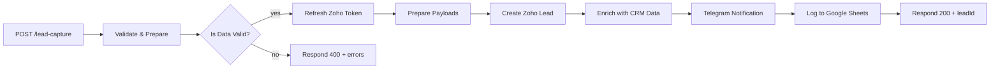

# Lead Capture + CRM Automation

> Production-ready no-code lead pipeline built with **n8n**. Takes a form submission and fans it out to Zoho CRM, Telegram, and Google Sheets in under two seconds — with input validation, OAuth token refresh, and structured JSON responses.


---

## 🎬 Demo


📺 [Watch full walkthrough on YouTube](https://youtu.be/YOUR_VIDEO_ID)

---

## ✨ What it does

When a visitor submits a contact form, this workflow:

1. **Accepts** a POST request at `/webhook/lead-capture`
2. **Validates** the payload — required fields, email format
3. **Splits** the full name into `First_Name` / `Last_Name` for CRM compatibility
4. **Refreshes** the Zoho OAuth access token using a long-lived refresh token
5. **Creates** a lead in Zoho CRM via the v2 REST API
6. **Enriches** the record with the freshly created Zoho lead ID
7. **Notifies** the sales team in Telegram with a rich HTML card
8. **Logs** the lead to a Google Sheet as a redundant, human-readable audit trail
9. **Responds** to the caller with a structured JSON status (200 on success, 400 on validation failure)

If any step after validation fails, the workflow continues gracefully and flags the issue in the Telegram message — so the sales team never loses a lead due to a downstream outage.

---

## 🏗️ Architecture



Full node-by-node breakdown in [docs/ARCHITECTURE.md](docs/ARCHITECTURE.md).

---

## 🧰 Tech stack

| Component | Purpose |
|---|---|
| **n8n** (self-hosted or cloud) | Orchestration engine |
| **Zoho CRM v2 API** | Primary system of record for leads |
| **OAuth 2.0 (refresh token flow)** | Zoho authentication |
| **Telegram Bot API** | Real-time sales notifications |
| **Google Apps Script** | Serverless webhook that writes to Sheets |

No credentials are stored in the workflow JSON — everything is configured via plain-text placeholders that you replace during setup.

---

## 🚀 Quick start

### Prerequisites

- A running n8n instance (v1.x) — [self-host](https://docs.n8n.io/hosting/) or [n8n Cloud](https://n8n.io/cloud/)
- A Zoho CRM account ([free tier works](https://www.zoho.com/crm/))
- A Telegram bot ([@BotFather](https://t.me/BotFather))
- A Google account (for Sheets + Apps Script)

### Install in 5 minutes

```bash
# 1. Clone this repo
git clone https://github.com/YOUR_USERNAME/lead-capture-crm-automation.git

# 2. Open n8n → Workflows → Import from File
#    Select: lead-capture-crm-automation.json

# 3. Follow the setup guide to fill in credentials
open docs/SETUP.md
```

### Test it

```bash
curl -X POST https://your-n8n.example.com/webhook/lead-capture \
  -H 'Content-Type: application/json' \
  -d '{
    "name": "John Doe",
    "email": "john@test.com",
    "phone": "+1234567890",
    "message": "I need your services",
    "source": "Landing Page"
  }'
```

**Expected response (200):**

```json
{
  "status": "success",
  "message": "Lead successfully processed",
  "zohoLeadId": "6543210000001234567",
  "lead": {
    "name": "John Doe",
    "email": "john@test.com"
  },
  "timestamp": "2026-01-15T10:30:00.000Z"
}
```

**Validation failure (400):**

```json
{
  "status": "error",
  "message": "Input validation failed",
  "errors": ["Field email is required", "Invalid email format"]
}
```

---

## 📂 Documentation

- **[Setup Guide](docs/SETUP.md)** — step-by-step credential configuration for Zoho, Telegram, and Google Sheets
- **[Architecture](docs/ARCHITECTURE.md)** — node-by-node breakdown, data flow, and design decisions
- **[Troubleshooting](docs/TROUBLESHOOTING.md)** — common errors and their fixes (including the `invalid_client` regional-domain gotcha)

---

## 🎯 Use cases

- **B2B landing pages** — capture leads from "Book a demo" forms
- **SaaS trial signups** — notify sales when high-value accounts register
- **Multi-channel campaigns** — route leads from ads, webinars, and partners into one pipeline
- **Agency client onboarding** — replace Zapier/Make with self-hosted automation at a fraction of the cost

---

## 🔧 Customization ideas

This workflow is a starting point. Common extensions:

- Swap Zoho for **HubSpot**, **Pipedrive**, or **Salesforce** (replace one HTTP node)
- Add **lead scoring** via an LLM node before creating the CRM record
- Route high-intent leads to **Slack** instead of Telegram
- Deduplicate against existing contacts before creating a new lead
- Enrich with **Clearbit** or **Apollo** data before CRM insert

---

## 📈 Why this over Zapier / Make?

| | This workflow (n8n) | Zapier |
|---|---|---|
| **Cost** at 5,000 leads/mo | $0 (self-hosted) or ~$20 (n8n Cloud) | ~$75+ |
| **Data ownership** | 100% on your infra | Routed through Zapier |
| **Custom logic** | Full JavaScript access | Limited |
| **Response time** | <2s end-to-end | 1–15 min (delayed runs) |

---

## 🤝 Available for work

I build custom n8n / Make / Zapier automations for startups and agencies.
Typical projects: CRM pipelines, AI-powered lead routing, internal tool integrations, API glue code.

- 📧 [your.email@example.com](mailto:your.email@example.com)
- 💼 [LinkedIn](https://linkedin.com/in/YOUR_HANDLE)
- 🐙 [More work on GitHub](https://github.com/YOUR_USERNAME)

---

## 📄 License

MIT — use it, fork it, sell it. Attribution appreciated but not required.
